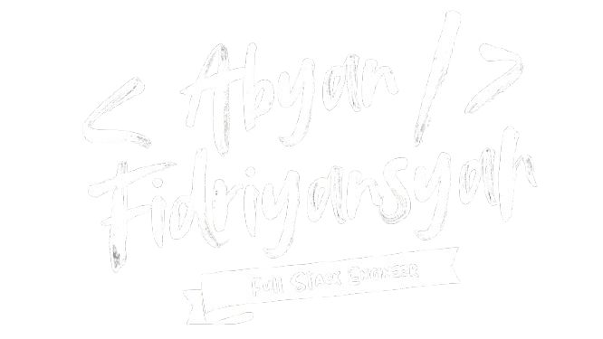

---

  

---

## Get To Know Me!
I’m an undergraduate computer science student with 2 years of experience in Full Stack Development. I specialize in creating intuitive and seamless web applications, handling both frontend interfaces and backend logic to deliver end-to-end solutions that are user-friendly and efficient.

I have a passion for technology and a constant drive to expand my skill set. While I’m always open to exploring new technologies and approaches, full-stack development is my primary focus. I enjoy the challenge of bridging the gap between design and functionality, ensuring that applications are not only visually appealing but also perform seamlessly under the hood.

  

--
